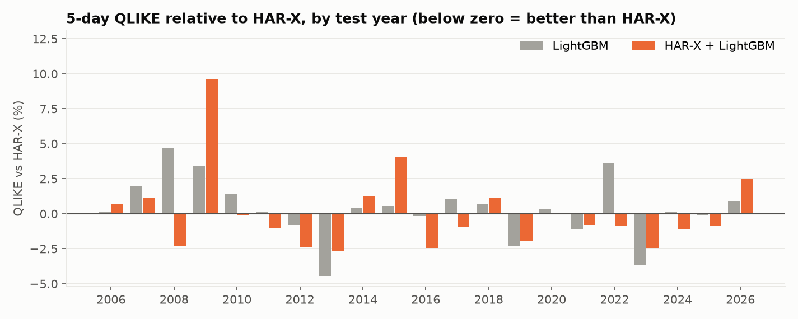
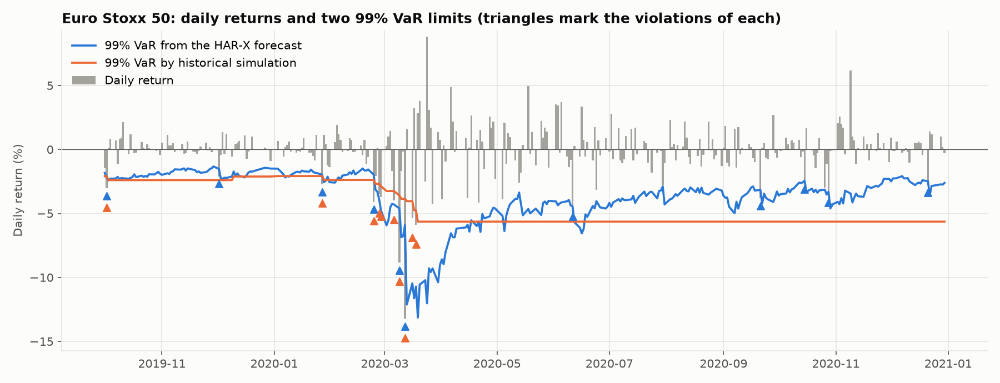
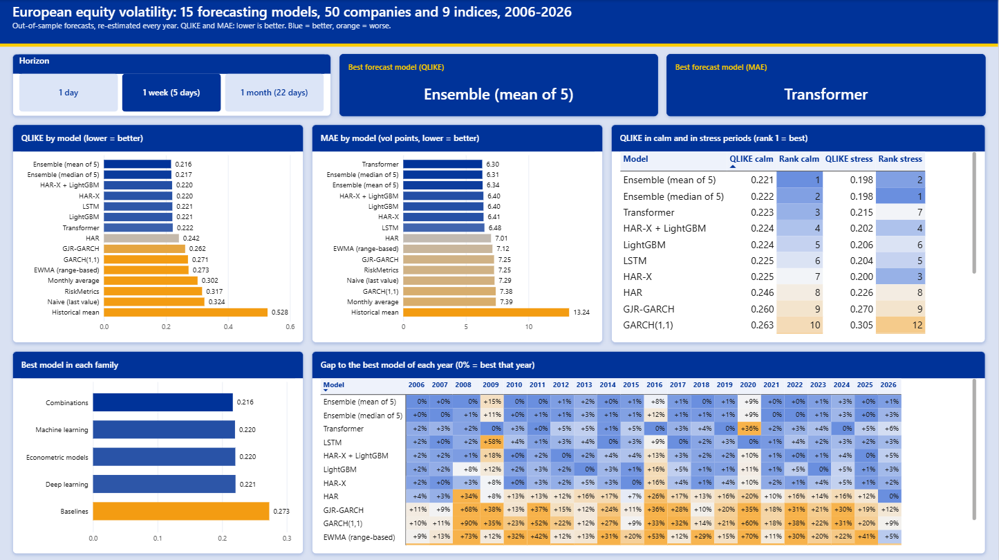
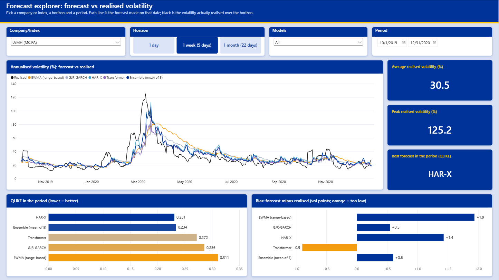
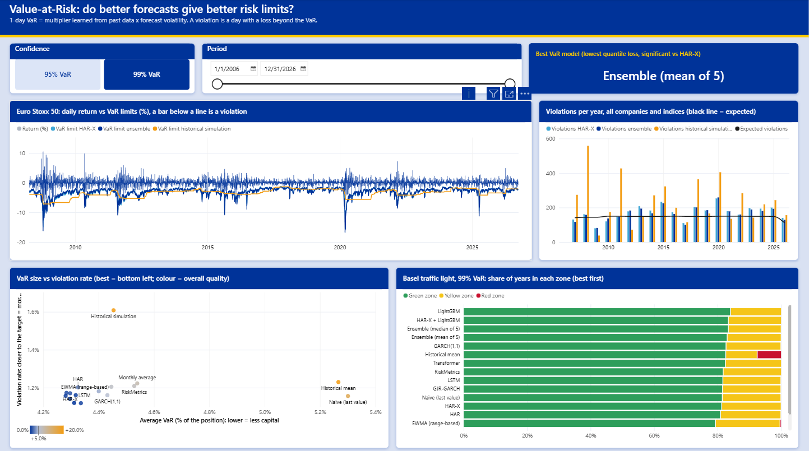
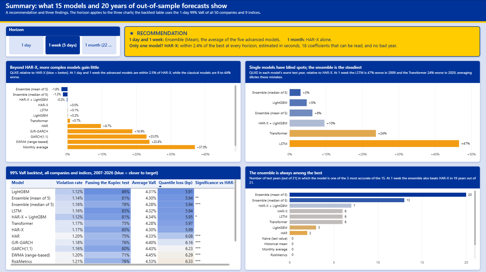

# European Equity Volatility Forecasting

**Can machine learning and deep learning forecast stock market volatility better than classical econometric models?**

This project benchmarks 15 volatility forecasting models, from simple baselines and GARCH to gradient boosting and Transformer neural networks, on **50 large European stocks and 9 European equity indices** (2000 to 2026). It then tests their practical value for risk management through a **Value-at-Risk backtest**, and presents the results in a **Power BI dashboard**.

## Key results

| Question | Answer |
|---|---|
| Do machine learning and deep learning beat the classical models? | **Only slightly, and only at short horizons.** At 1 day, LightGBM, the LSTM and the Transformer are 1.3 to 1.9% more accurate than HAR-X, the best classical model (2.4% for their average). At 1 week they cannot be told apart from it, and at 1 month HAR-X is the best model. Measuring volatility well and choosing the right inputs matter far more than the algorithm: HAR-X is 14 to 20% better than the best simple rule. |
| Are the differences significant, in calm and in crisis periods? | **At 1 day yes (p < 0.01); at 1 week only for combinations of models.** The average of the five advanced models is the one reliable improvement: significantly better than HAR-X at 1 day and 1 week, and better in 19 test years out of 21. Single models have blind spots: the Transformer is among the best in calm markets and falls behind in crises. |
| Do better forecasts give better Value-at-Risk? | **Yes, but the big step is from no model to any model.** Historical simulation is outside the Basel green zone in 37% of years, the best volatility models in 16 to 19%. A better forecast buys the same protection with less capital (an average 99% VaR of 4.30% of the position for HAR-X against 5.30% for the naive forecast). Beyond HAR-X, the gains are below 1.3%. |

**Recommendation.** For 1 to 5 days, the average of the five advanced models; for a month, HAR-X alone. If only one model can be maintained, HAR-X: within 2.4% of the best at every horizon, estimated in seconds, 18 coefficients that can be read, and no bad year.

## Why volatility?

Stock prices are close to unpredictable, but **volatility (how much prices move) is not**: turbulent days follow turbulent days (clustering), falls raise volatility more than rises (leverage effect), and after a crisis volatility returns to its long-run level (mean reversion). Volatility forecasts are used every day for Value-at-Risk and trading limits (banks, Basel regulation), volatility targeting (asset managers), option pricing, hedging and margin requirements.

## Research questions

1. Do machine learning and deep learning models beat classical models (GARCH, HAR) at forecasting volatility at 1-day, 1-week and 1-month horizons?
2. Are the differences **statistically significant**, and do they hold in both calm and crisis periods?
3. Do better forecasts translate into better **Value-at-Risk** estimates?

## Data

- **Source:** Yahoo Finance via `yfinance`: daily open, high, low, close, adjusted close and volume, January 2000 to 2026 (dot-com crash, 2008, euro debt crisis, COVID-19, the 2022 rate shock)
- **Universe** ([`data/universe.csv`](data/universe.csv)): 50 large, liquid stocks from 13 countries and 11 sectors; 9 indices (Euro Stoxx 50, CAC 40, DAX, FTSE 100, SMI, AEX, IBEX 35, FTSE MIB, OMX Stockholm 30); the VIX as an implied-volatility feature (VSTOXX, its European equivalent, has no free source)

**Storage: PostgreSQL.** Every stage reads from and writes to a local database (`volatility_db`, schema in [`sql/schema.sql`](sql/schema.sql)), so each result can be traced back to its inputs and the scores can be recomputed in SQL:

```
universe ──┬──< prices_raw          (ticker, date)  raw daily prices from Yahoo, with a download log
           ├──< prices_clean        (ticker, date)  cleaned prices, plus a log of every correction
           ├──< features            (ticker, date)  daily variance, 18 features, 3 targets
           ├──< forecasts           (horizon, ticker, date)  out-of-sample forecasts, one column per model
           ├──< model_scores >───── models          losses per model, horizon, ticker and test year
           └──< var_backtest                        Value-at-Risk violations and tests per model
                pbi_* views                         inputs of the Power BI dashboard
```

Loads are idempotent (upserts on the primary key), raw data is kept raw so errors can be detected and logged, and credentials stay in a local `.env` file that is never committed.

## Data quality

Raw Yahoo Finance data contains errors that would make volatility estimates meaningless. [`src/data/clean_prices.py`](src/data/clean_prices.py) applies nine documented rules and records every change in a `cleaning_log` table; investigation in [`notebooks/01_data_quality.ipynb`](notebooks/01_data_quality.ipynb).

| Issue found | Example | Action |
|---|---|---|
| Holidays filled with an old price (zero volume) | Christmas, 1 May, Good Friday | Row dropped |
| Isolated bad prints that revert the next day | Novo Nordisk: 33 prices 2 to 5 times away from their neighbours | Row dropped |
| Intraday prices on a different basis than the close | Vodafone before 2007: range-based volatility 10 to 100 times too high | Open / high / low set to NULL |
| Impossible high or low | Shell and BP in 2019: low quoted in pounds instead of pence | Open / high / low set to NULL |
| Negative adjusted close | AB InBev 2000-2008 | Set to NULL; returns use the split-adjusted close |

Only 1.1% of rows are dropped; genuine crashes are kept (ABB -62% in October 2002). Unit tests check every rule on synthetic data, and database constraints prevent any inconsistent row from being stored.


**Known limitations:** survivorship bias (today's large companies only), shorter histories for a few series, and the VIX closes after Europe, so it is lagged by one day.

## Exploratory analysis

[`notebooks/02_eda.ipynb`](notebooks/02_eda.ipynb) checks the stylised facts that volatility models rely on (331,000 daily stock returns). Each finding drives a design choice:

| Finding | Evidence | Consequence |
|---|---|---|
| Regimes | Median-stock volatility from 12% to 101% (November 2008); 22% outside crises | Results reported for calm and crisis periods |
| Clustering and long memory | Absolute returns stay autocorrelated for 100+ days; returns do not | HAR (day / week / month) as the benchmark to beat |
| Fat tails | Moves beyond 5 standard deviations about 4,700 times more frequent than under a normal distribution | QLIKE loss; VaR multiplier learned from the data |
| Leverage effect | After a fall of more than 4%, 5-day volatility averages 54%, against 48% after a rise | Negative-return features; GJR-GARCH |
| Skewness | 3.1 for volatility, 0.5 for its logarithm | Models forecast log volatility |
| Co-movement | Average correlation of 0.87 between index volatilities | One pooled model for all series; market-wide features |


## Volatility measure, targets and features

Details in [`notebooks/03_features.ipynb`](notebooks/03_features.ipynb); code in [`src/features/`](src/features/).

- **Measure.** Daily variance from the full open / high / low / close information: overnight return² + Garman-Klass variance of the session. It has the same level as squared returns but is far less noisy (day-to-day autocorrelation 0.58 against 0.15).
- **Targets.** For 1, 5 and 22 trading days: the log of the average daily variance over the next *h* days.
- **Features.** 18 variables in six groups: own volatility (day, week, month, quarter, long-run level), returns (leverage), volatility of volatility and trading volume, market-wide volatility, the VIX (lagged one US session), and the day of the week. 371,839 complete rows.
- **No look-ahead.** Unit tests rebuild the features on data truncated at a date *T* and require them to be identical to the full-sample features up to *T*.


## Evaluation framework and baselines

Every model is evaluated by the same code, on the same dates and with the same losses. Details in [`notebooks/04_baselines.ipynb`](notebooks/04_baselines.ipynb).

- **Walk-forward backtest:** each year from 2006 to 2026 is forecast by a model trained only on earlier data (expanding window, 21 test years, an embargo of *h* days so that training targets never overlap the test year).
- **Losses:** QLIKE (primary: robust to the noise in the variance measure, and under-predicting risk costs more than over-predicting it), the MSE of log variance, and the MAE in volatility points for interpretation. Scores are computed in SQL from the stored forecasts, on the dates where every model has a forecast.
- **Baselines:** five rules with no estimated parameters. The best is an EWMA of the range-based variance (5-day QLIKE 0.273, error of 7.1 volatility points); feeding the same formula the range-based variance instead of squared returns (RiskMetrics) lowers QLIKE by 8 to 16%: measuring volatility well matters as much as the model.


## Econometric models

GARCH(1,1) and GJR-GARCH (one model per series, maximum likelihood, written from scratch and checked against the `arch` package), HAR and HAR-X (pooled linear regressions; HAR-X adds the 14 other features). Details in [`notebooks/05_econometric_models.ipynb`](notebooks/05_econometric_models.ipynb).

| Out-of-sample QLIKE (lower is better) | 1 day | 5 days | 22 days |
|---|---|---|---|
| **HAR-X** | **0.378** | **0.220** | **0.199** |
| HAR | 0.400 | 0.242 | 0.212 |
| GJR-GARCH | 0.431 | 0.262 | 0.222 |
| GARCH(1,1) | 0.441 | 0.271 | 0.226 |
| EWMA (best baseline) | 0.440 | 0.273 | 0.250 |

- **HAR-X is the model to beat:** 14% (1 day) to 20% (22 days) better than the best baseline, in calm and in crisis periods, for stocks and for indices.
- **The leverage effect is confirmed:** in GJR-GARCH a fall moves the variance more than twice as much as a rise for 90% of the series.
- **A model of the log variance needs a correction** to forecast the variance (the exponential of a predicted log is a median, about 20% too low); a smearing factor estimated in training fixes it.


## Machine learning: LightGBM

Gradient-boosted trees trained directly on QLIKE (gamma objective), with hyperparameters tuned by Optuna on the last two years of each training window. Two designs: **LightGBM** forecasts from the features, the **hybrid** learns a multiplicative correction to HAR-X. Details in [`notebooks/06_lightgbm.ipynb`](notebooks/06_lightgbm.ipynb).

- **LightGBM matches HAR-X but does not beat it overall:** 1.8% better at 1 day (hybrid), equal at 5 days, 8% worse at 22 days. In logarithms volatility is close to linear: 18 coefficients capture almost everything hundreds of trees can find.
- **How a tree model is used matters.** A tree cannot forecast a level it has never seen: in 2008 LightGBM alone is 5% worse than HAR-X, while the hybrid, where HAR-X carries the level, is 2% better. The hybrid beats HAR-X in 14 test years out of 21, LightGBM alone in 7.



## Deep learning: LSTM and Transformer

Two networks written in PyTorch read the raw last 22 days, next to a linear HAR-X path initialised with its least-squares solution, so training starts from HAR-X. One network for the three horizons, trained on QLIKE, with early stopping on the last year of each training window. Details in [`notebooks/07_deep_learning.ipynb`](notebooks/07_deep_learning.ipynb).

- **Deep learning does not beat HAR-X either:** about 1.4% better at 1 day, level at 5 days, worse at 22 days (+3.6% for the LSTM, +6.8% for the Transformer). Across three families of models, accuracy converges to the same level: what remains is mostly unpredictable.
- **Complex models fail differently:** by rare, large errors in years unlike their training data (the LSTM 47% worse than HAR-X in 2009, the Transformer 24% worse in 2020).

**The most accurate model on average is not the safest one.** The Transformer has the lowest MAE of the single models at 5 and 22 days (6.30 volatility points against 6.41 for HAR-X), but a worse QLIKE, and in stress periods it falls well behind (0.215 against 0.200). It is very close on ordinary days and too low on the few days when volatility jumps. MAE treats a forecast that is 20 points too low like one that is 20 points too high; QLIKE makes under-estimation cost two and a half times more, which is what matters when the forecast sizes a risk limit. This is why the loss was fixed before looking at the results.


## Model comparison: what is really different, and why

[`notebooks/08_model_comparison.ipynb`](notebooks/08_model_comparison.ipynb); code in [`src/evaluation/stats.py`](src/evaluation/stats.py).

| Out-of-sample QLIKE, 2006-2026 | 1 day | 5 days | 22 days |
|---|---|---|---|
| **Ensemble (Mean)**: average of HAR-X, both LightGBM models and both networks | **0.369** | **0.216** | 0.202 |
| Ensemble (Median) of the same five | 0.370 | 0.217 | 0.201 |
| HAR-X + LightGBM | 0.371 | 0.220 | 0.214 |
| HAR-X | 0.378 | 0.220 | **0.199** |
| LSTM | 0.373 | 0.221 | 0.206 |
| LightGBM | 0.372 | 0.221 | 0.216 |
| Transformer | 0.372 | 0.222 | 0.212 |
| EWMA (best baseline) | 0.440 | 0.273 | 0.250 |

**Why HAR-X is the benchmark.** From the machine learning models on, every model is compared with HAR-X rather than with a baseline or with the best model of the table:

- **It is the best model without machine learning.** HAR-X beats the baselines, GARCH, GJR-GARCH and HAR at every horizon. Against a weak baseline every advanced model looks like a breakthrough (14 to 21% better); the useful question is whether machine learning adds anything **to the best classical tool**.
- **It starts from the same information.** LightGBM uses the features of HAR-X, and the networks contain a HAR-X regression: the gap with HAR-X measures what the **algorithm** adds, not extra data. Where an advanced model had one extra input (a stock / index flag), HAR-X was given it too before concluding.
- **It is the standard benchmark of the field** (Corsi, 2009), and **the cheap, transparent alternative**: estimated in seconds, 18 readable coefficients. A model that needs hours of training has to earn that cost by beating it.

The reference changes how results are expressed, not the ranking; the Model Confidence Set, which uses no reference, tells the same story.

**Are the differences real?** Diebold-Mariano tests (one observation per date, Newey-West variance) and the Model Confidence Set:

- **1 day:** the five advanced models and both combinations are significantly better than HAR-X (p < 0.01), by 1.3 to 2.4%.
- **5 days:** a linear regression, trees, an LSTM and a Transformer cannot be distinguished (p = 0.56 to 0.91 against HAR-X); only the combinations are significantly better.
- **22 days:** HAR-X is the best, and the LightGBM models are significantly worse (+8%).

**Combining models is the one reliable improvement.** The average of the five models, with members and equal weights fixed in advance, is better than HAR-X in 19 test years out of 21, because single models fail in different years. The result holds with four or three members.


## Application: Value-at-Risk backtest

[`notebooks/09_var_backtest.ipynb`](notebooks/09_var_backtest.ipynb); code in [`src/risk/`](src/risk/).

The 1-day **Value-at-Risk** (VaR) at 99% is the loss that should be exceeded on only 1 day out of 100; a day on which it is exceeded is a **violation**. Each model's 1-day forecast becomes a VaR: *VaR = multiplier × forecast volatility*, with the multiplier learned from the model's own past standardised returns (filtered historical simulation). The benchmark without a volatility model is **historical simulation** (quantile of the last 250 returns). 293,336 daily returns per model, 2007 to 2026, judged by the Kupiec test (right number of violations), the Christoffersen test (no clustering), the Basel traffic light and the quantile loss.

| 99% VaR | Violations (promised: 1%) | Series passing Kupiec | Series without clustering | Average VaR | Quantile loss vs HAR-X | Years outside the green zone |
|---|---|---|---|---|---|---|
| Historical simulation | 1.61% | 0% | 31% | 4.45% | +18.4% | 37% |
| RiskMetrics | 1.21% | 76% | 85% | 4.53% | +5.7% | 18% |
| HAR-X | 1.17% | 80% | 95% | 4.30% | reference | 19% |
| **Ensemble (Mean)** | **1.14%** | **81%** | **98%** | **4.30%** | **-0.9%** (significant) | **17%** |

- **Any volatility model beats historical simulation by a wide margin:** fewer violations, far less clustering, a quantile loss 11% lower with RiskMetrics alone.
- **Returns have fat tails whatever the model:** the normal multiplier fails at 99% for every model (1.6 to 1.8% of violations); it has to be learned from the data.
- **Counting violations shows whether a VaR is honest, not whether it is good.** With a learned multiplier the naive forecast passes the Kupiec test as often as HAR-X, but needs a VaR of 5.30% of the position against 4.30%.
- **No model kept the promise in 2020** (1.7% of violations at best): a crash that starts from a calm market cannot be forecast from past prices.



## Power BI dashboard

Four pages built in Power BI Desktop on thirteen PostgreSQL views ([`sql/powerbi_views.sql`](sql/powerbi_views.sql)); all statistics are computed in Python and SQL, the dashboard only aggregates them with 60 DAX measures. Colour rule: blue = better, orange = worse. Setup guide: [`powerbi/README.md`](powerbi/README.md).

**1. Model performance:** ranking of the 15 models by QLIKE and by MAE, calm vs stress periods, best model per family and per year.



**2. Forecast explorer:** forecast and realised volatility of any company or index through time, with the accuracy and bias of each forecast over the selected period.



**3. Value-at-Risk:** daily returns against the VaR limits of the Euro Stoxx 50, violations per year, VaR size against violation rate, Basel traffic light, and the best VaR model at each confidence level.



**4. Summary:** the recommendation and the three findings that support it, with the VaR backtest of all models.



## Limitations

- **Daily data only:** realised volatility from intraday prices would be a more precise target and input.
- **Survivorship bias:** the universe contains today's large companies.
- **VaR:** one-day horizon, each stock or index on its own (a portfolio VaR also needs correlations), and Expected Shortfall (the average loss beyond the VaR) is not covered.
- **Neural networks:** sizes chosen by judgement rather than tuned, one random seed per training.

## Tech stack

- **Python:** pandas, NumPy, SciPy, yfinance; LightGBM and Optuna; PyTorch (LSTM and Transformer written from scratch); matplotlib; pytest
- **Database:** PostgreSQL, SQLAlchemy, psycopg2; scores and dashboard views in SQL
- **Dashboard:** Power BI Desktop (Power BI project format, DAX)

## Repository structure

```
european-volatility-forecasting/
├── data/universe.csv   # tickers with country, sector, currency
├── sql/                # schema, loss functions in SQL, Power BI views
├── notebooks/          # 01_data_quality … 09_var_backtest, one per step
├── src/
│   ├── data/           # database setup, download and cleaning
│   ├── features/       # volatility estimators, targets, features
│   ├── models/         # baselines, GARCH, HAR, LightGBM, neural networks
│   ├── evaluation/     # walk-forward backtest, losses, statistical tests, combinations
│   ├── risk/           # Value-at-Risk construction and backtests
│   └── dashboard/      # creates the views read by Power BI
├── tests/              # unit tests (incl. data-leakage checks)
├── reports/figures/    # charts used in this README
├── powerbi/            # Power BI project (.pbip), theme, DAX measures and guide
└── .env.example        # template for database credentials
```

## Getting started

**Prerequisites:** Python 3.10+ and [PostgreSQL](https://www.postgresql.org/download/) running locally.

```bash
git clone https://github.com/vinhdang111/european-volatility-forecasting.git
cd european-volatility-forecasting
python -m venv .venv
source .venv/bin/activate        # Windows: .venv\Scripts\activate
pip install -r requirements.txt
pip install -e .                 # makes `src` importable from notebooks
```

Copy `.env.example` to `.env` and enter your PostgreSQL password, then run the pipeline:

```bash
python -m src.data.setup_db              # database, tables, universe
python -m src.data.fetch_prices          # download prices (~2-3 minutes)
python -m src.data.clean_prices          # clean prices
python -m src.features.build_features    # variance, features, targets
python -m src.models.run_baselines       # baselines
python -m src.models.run_econometric     # GARCH, GJR-GARCH, HAR, HAR-X (a few minutes)
python -m src.models.run_lightgbm        # LightGBM and hybrid (20 to 40 minutes)
python -m src.models.run_deep            # LSTM and Transformer (pip install -r requirements-dl.txt)
python -m src.evaluation.run_comparison  # combinations and statistical tests
python -m src.risk.run_var_backtest      # Value-at-Risk backtest
python -m src.dashboard.setup_views      # views read by Power BI
python -m pytest                         # unit tests
```

The networks train on a GPU if PyTorch finds one; on a laptop CPU the LSTM takes about 25 minutes and the Transformer several hours (`--refit-every 3` trains one network every three years).

## Project status

| Step | Description | Status |
|---|---|---|
| 0 | Project setup | ✅ Done |
| 1 | Data collection | ✅ Done |
| 2 | Data cleaning and quality checks | ✅ Done |
| 3 | Exploratory analysis: stylised facts of volatility | ✅ Done |
| 4 | Volatility targets and feature engineering | ✅ Done |
| 5 | Evaluation framework and baselines | ✅ Done |
| 6 | Econometric models (GARCH, GJR-GARCH, HAR) | ✅ Done |
| 7 | Machine learning (LightGBM) | ✅ Done |
| 8 | Deep learning (LSTM, Transformer) | ✅ Done |
| 9 | Model comparison and statistical analysis | ✅ Done |
| 10 | Application: Value-at-Risk backtesting | ✅ Done |
| 11 | Interactive dashboard (Power BI) | ✅ Done |

## Author

**Thanh Vinh Dang**

[LinkedIn](https://www.linkedin.com/in/thanhvinhdang2001) · thanhvinhdang.work@gmail.com
