# European Equity Volatility Forecasting

**Can machine learning and deep learning forecast stock market volatility better than classical econometric models?**

This project benchmarks volatility forecasting models, from simple baselines and GARCH to gradient boosting and transformer-based neural networks, on **50 large European stocks and 9 European equity indices** (2000 to today), and evaluates their practical value for risk management through **Value-at-Risk backtesting**.

> 🚧 **Work in progress.** The project is built step by step; see [Project Status](#project-status) below.

---

## Why volatility?

Stock prices are close to unpredictable, but **volatility (how much prices move) is not**. It shows well-documented patterns:

- **Volatility clustering:** turbulent days tend to follow turbulent days
- **Leverage effect:** falling prices increase volatility more than rising prices do
- **Mean reversion:** after a crisis, volatility gradually returns to its long-run level

Volatility forecasts are used every day in finance:

| Use case | Who uses it |
|---|---|
| Value-at-Risk and trading limits | Bank risk management, regulators (Basel) |
| Volatility targeting and risk parity | Asset managers, funds |
| Option pricing | Derivatives traders |
| Hedging decisions | Corporate treasury |
| Margin requirements | Exchanges and clearing houses |

## Research questions

1. Do ML and deep learning models beat classical models (GARCH, HAR) at forecasting volatility at 1-day, 1-week and 1-month horizons?
2. Are the differences **statistically significant**, and do they hold in both calm and crisis periods?
3. Which information matters most (past volatility, price ranges, volume, VIX)?
4. Does a single model trained on all European stocks generalise to markets it has never seen?
5. Do better forecasts translate into better **Value-at-Risk** estimates?

## Data

- **Source:** Yahoo Finance via `yfinance`: daily Open, High, Low, Close, Adjusted Close and Volume
- **Period:** January 2000 to present, covering the dot-com crash, the 2008 financial crisis, the euro debt crisis (2011), Brexit (2016), COVID-19 (2020), the energy and rate shock (2022) and the Credit Suisse collapse (2023)
- **Universe:** 60 series, defined in [`data/universe.csv`](data/universe.csv)

| Type | Count | Content |
|---|---|---|
| Stocks | 50 | Large, liquid European companies across 13 countries and 11 sectors |
| Indices | 9 | Euro Stoxx 50, CAC 40, DAX, FTSE 100, SMI, AEX, IBEX 35, FTSE MIB, OMX Stockholm 30 |
| External | 1 | VIX (US market-fear index) |

**Stocks by country**

| Country | # | Tickers |
|---|---|---|
| France | 8 | MC.PA, TTE.PA, SAN.PA, BNP.PA, AIR.PA, OR.PA, SU.PA, AI.PA |
| Germany | 8 | SAP.DE, SIE.DE, ALV.DE, DTE.DE, BAS.DE, MBG.DE, DBK.DE, BAYN.DE |
| United Kingdom | 7 | SHEL.L, AZN.L, HSBA.L, BP.L, ULVR.L, RIO.L, VOD.L |
| Switzerland | 6 | NESN.SW, NOVN.SW, RO.SW, UBSG.SW, ZURN.SW, ABBN.SW |
| Netherlands | 4 | ASML.AS, INGA.AS, PHIA.AS, AD.AS |
| Spain | 4 | SAN.MC, IBE.MC, ITX.MC, TEF.MC |
| Italy | 3 | ENEL.MI, ENI.MI, ISP.MI |
| Sweden | 3 | VOLV-B.ST, ERIC-B.ST, ATCO-A.ST |
| Denmark | 2 | NOVO-B.CO, MAERSK-B.CO |
| Finland | 2 | NOKIA.HE, NDA-FI.HE |
| Luxembourg | 1 | MT.AS (ArcelorMittal) |
| Norway | 1 | EQNR.OL |
| Belgium | 1 | ABI.BR |

**Stocks by sector:** Banks 8 · Health Care 7 · Industrials 7 · Energy 5 · Consumer Staples 5 · Materials 4 · Technology 4 · Consumer Discretionary 3 · Telecom 3 · Insurance 2 · Utilities 2

### Storage: PostgreSQL

All data is stored in a local **PostgreSQL** database (`volatility_db`). The schema is defined in [`sql/schema.sql`](sql/schema.sql):

```
universe ──┬──< prices_raw          (ticker, date)  raw daily OHLCV from Yahoo
           ├──< prices_clean        (ticker, date)  cleaned prices (Step 2)
           ├──< cleaning_log                        every correction made (Step 2)
           ├──< features            (ticker, date)  daily variance, features, targets (Step 4)
           ├──< forecasts           (horizon, ticker, date)  out-of-sample forecasts, one column per model (Step 5)
           ├──< model_scores >───── models          losses per model, horizon, ticker and test year (Step 5)
           │                        models ──< model_parameters   estimated parameters of every fit (Step 6)
           └──< download_log >──── download_runs    audit trail of every download
```

| Table / view | Grain | Content |
|---|---|---|
| `universe` | 1 row per ticker | Name, asset type, country, exchange, sector, currency (loaded from `data/universe.csv`) |
| `prices_raw` | 1 row per ticker and trading day | Open, high, low, close, adjusted close, volume, download timestamp |
| `download_runs` | 1 row per run | Date range requested, start/end time, tickers and rows downloaded |
| `download_log` | 1 row per ticker per run | Status, first/last date, years of history, missing values, zero-volume days, suspicious jumps (> 50%) |
| `latest_download_report` *(view)* | 1 row per ticker | Quality report of the most recent run |
| `prices_clean` | 1 row per ticker and trading day | Cleaned prices, with sanity constraints (Step 2) |
| `cleaning_log` | 1 row per change | Ticker, date, rule, action and detail of every correction (Step 2) |
| `cleaning_summary`, `data_coverage` *(views)* | 1 row per rule / ticker | Summary of the cleaning; rows kept and dropped per ticker |
| `features` | 1 row per stock / index and trading day | Daily variance, 18 features and 3 forecast targets (Step 4) |
| `model_dataset` *(view)* | 1 row per stock / index and trading day | `features` joined with sector, country and asset type, plus volatilities in % |
| `forecasts` | 1 row per horizon, ticker and forecast date | Out-of-sample variance forecasts, one column per model (Step 5) |
| `forecasts_long`, `forecast_vs_actual` *(views)* | 1 row per model, horizon, ticker and date | The same forecasts in long format; forecast and realised volatility in % side by side (for Power BI) |
| `models` | 1 row per model | Model name, family and description |
| `model_scores` | 1 row per model, horizon, ticker and test year | QLIKE, log MSE and MAE, computed in SQL on the common sample ([`sql/score_models.sql`](sql/score_models.sql)) |
| `model_scores_overall` *(view)* | 1 row per model and horizon | Overall losses and rank of each model |
| `model_parameters` | 1 row per model, horizon, fit, series and parameter | Estimated parameters of every walk-forward fit: GARCH α, β, γ per series, HAR coefficients (Step 6), LightGBM hyperparameters and SHAP importances (Step 7) |
| `model_tests` | 1 row per horizon and ordered pair of models | Diebold-Mariano tests: loss difference, statistic, p-value (Step 9) |
| `model_confidence_set` | 1 row per horizon and model | Model Confidence Set: p-value and membership (Step 9) |
| `experiment_scores` | 1 row per experiment, variant, horizon and segment | Ablation of feature groups and forecasts of unseen regions (Step 9) |

### Download pipeline

1. [`src/data/setup_db.py`](src/data/setup_db.py) creates the database and tables and loads the universe.
2. [`src/data/fetch_prices.py`](src/data/fetch_prices.py) downloads every series from Yahoo Finance and writes it to `prices_raw`, logging each ticker in `download_log`.

Design choices:

- **Raw data is kept raw.** Prices are stored unadjusted and unfilled, and `prices_raw` deliberately has no sanity constraints (e.g. `high >= low`): wrong values must be stored so they can be detected, logged and fixed in Step 2.
- **Idempotent loads.** Prices are written with an *upsert* (`INSERT ... ON CONFLICT DO UPDATE`) on the primary key `(ticker, date)`, so re-running the download updates rows instead of duplicating them.
- **Referential integrity.** Every price and log row must reference a ticker in `universe` (foreign keys).
- **Auditability.** Every run and every ticker's outcome is recorded, so data issues can be traced back to a specific download.
- **Each series keeps its own trading calendar.** European exchanges have different holidays; no artificial rows are created.
- **Robust downloading.** Each ticker is retried up to 3 times, and a missing ticker does not stop the pipeline.
- **Credentials stay local.** Connection settings live in a `.env` file that is never committed (template: [`.env.example`](.env.example)).

## Data quality

Raw Yahoo Finance data contains several kinds of errors. [`src/data/clean_prices.py`](src/data/clean_prices.py) rebuilds `prices_clean` from `prices_raw` with nine documented rules, and records **every change** (ticker, date, rule, action, detail) in the `cleaning_log` table. The full investigation is in [`notebooks/01_data_quality.ipynb`](notebooks/01_data_quality.ipynb).

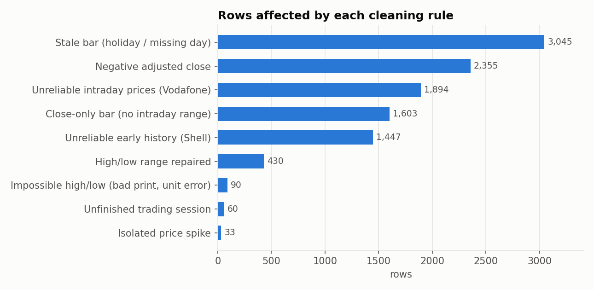

| Issue found | Example | Rule | Action |
|---|---|---|---|
| Holidays and missing days filled with an old price (zero volume) | Christmas, 1 May, Good Friday | `stale_bar` | Row dropped |
| Frozen early history | Shell before the July 2005 unification: no trade on >90% of days in 2000 | `before_valid_from` | Rows dropped (`valid_from` in `universe.csv`) |
| Isolated bad prints that revert the next day | Novo Nordisk: 33 prices 2-5x away from their neighbours | `price_spike` | Row dropped |
| Intraday prices on a different basis than the close | Vodafone before mid-2007: range-based volatility 10 to 100 times too high | `unreliable_range` | Open/high/low set to NULL (`range_valid_from` in `universe.csv`) |
| Impossible high or low | Shell and BP in 2019: low quoted in pounds instead of pence; bad prints 15%+ beyond both open and close | `implausible_range` | Open/high/low set to NULL |
| Open or close outside the [low, high] range | Mostly before 2005 | `range_repair` | Range widened |
| Close-only bars (open = high = low = close) | FTSE MIB until 2003, Vodafone until 2002 | `close_only_bar` | Open/high/low set to NULL |
| Negative adjusted close | AB InBev 2000-2008, Inditex 2001-2002 | `invalid_adj_close` | Set to NULL |
| Session still trading when downloaded | Data downloaded during market hours | `incomplete_session` | Row dropped |

Only **1.1% of rows are dropped**. Genuine extreme moves are kept, e.g. ABB's -62% on 22 Oct 2002 (asbestos crisis) or Rio Tinto's -37% on 25 Nov 2008. The spike filter only removes prices that immediately revert.

Why it matters: a handful of bad prints is enough to make volatility estimates meaningless.

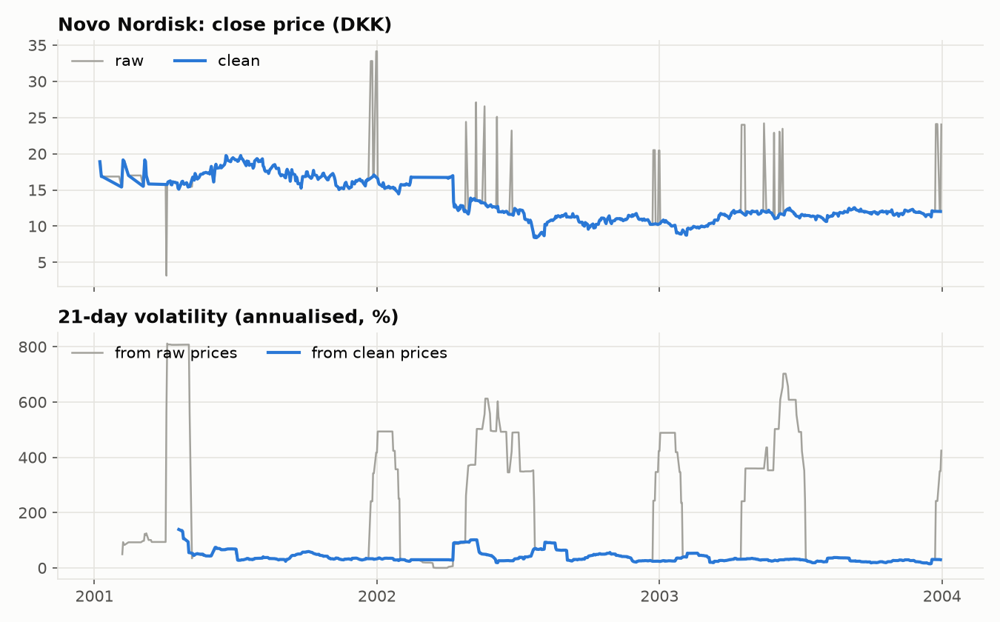

Design decisions:

- **Returns will be computed from `close`**, which Yahoo adjusts for stock splits. `adj_close` is unreliable (negative values, 25-40% one-day jumps in the adjustment factor) and is kept for reference only.
- **Database constraints** on `prices_clean` (`close > 0`, `high >= low`, open and close within the range…) guarantee that no inconsistent row can be stored.
- **Unit tests** ([`tests/test_clean_prices.py`](tests/test_clean_prices.py)) check each rule on synthetic data, including that genuine crashes and VIX spikes are *not* removed.

Known limitations:

- **Survivorship bias:** the universe contains today's large companies, so firms that disappeared (e.g. Credit Suisse) are excluded.
- **Shorter histories:** some series start after 2000 (e.g. Ahold Delhaize, ArcelorMittal, Euro Stoxx 50, OMX Stockholm 30 on Yahoo).
- **Coarse price ticks in the early 2000s** produce more unchanged-price days (e.g. Equinor), which slightly lowers measured volatility in that period.
- **VIX** closes after European markets, so it must be lagged by one day when used as a feature (Step 4).
- **VSTOXX**, the European equivalent of the VIX, would be the closer match for European stocks, but it is not available on Yahoo Finance and has no free, automatable source, so the project uses the VIX as its implied-volatility feature.

## Key findings from the exploratory analysis

[`notebooks/02_eda.ipynb`](notebooks/02_eda.ipynb) checks the *stylised facts* that volatility models rely on, using 331,000 daily stock returns (2000 to September 2026). Each finding drives a design choice in the following steps.

**Volatility moves between calm regimes and short, violent crises.** The volatility of the median stock ranges from 12% to 101% (3 November 2008). It averaged 40% during the financial crisis and 51% during COVID-19, against 22% outside the shaded periods.

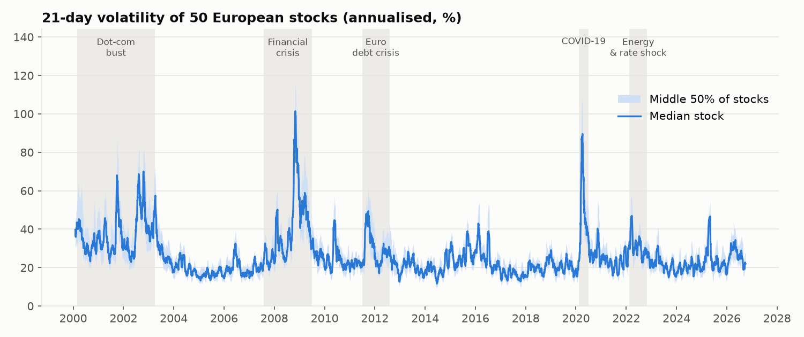

**Volatility is forecastable, returns are not.** Daily returns have no memory (autocorrelation ≈ 0), but their size does: the autocorrelation of absolute returns is 0.23 at one day and still 0.09 after 100 days.

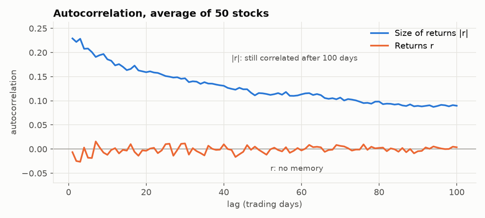

**Falls raise volatility more than rises.** After a drop of more than 4%, volatility over the next five days averages 54%, against 48% after a rise of the same size.

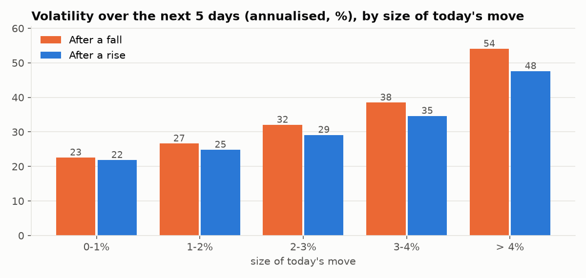

| Finding | Evidence | Consequence for the project |
|---|---|---|
| Fat tails | Moves beyond 5 standard deviations are about 4,700 times more frequent than under a normal distribution | Robust loss function (QLIKE); VaR backtesting |
| Clustering and long memory | Absolute returns stay autocorrelated for 100+ days | HAR (day / week / month) as the benchmark to beat |
| Regimes | Median-stock volatility between 12% and 101% | Results reported separately for calm and crisis periods |
| Leverage effect | Falls are followed by more volatility than rises | Negative-return features; GJR-GARCH |
| Skewness | Skewness 3.1 for volatility, 0.5 for its logarithm | Models forecast log volatility |
| Co-movement | Average correlation of 0.87 between index volatilities; lagged VIX as informative as an index's own past volatility | One pooled model for all series; VIX feature tested by ablation |
| Sector levels | From 23% (consumer staples) to 43% (technology) | Per-series scaling or sector features |

## Volatility measure, targets and features

Details and checks in [`notebooks/03_features.ipynb`](notebooks/03_features.ipynb); code in [`src/features/`](src/features/).

**Measure.** Volatility on a single day cannot be observed. The squared daily return is unbiased but extremely noisy, so the project measures daily variance from the full open/high/low/close information:

> `rv` = (overnight return)² + Garman-Klass variance of the trading session

with a fallback to the squared close-to-close return when the intraday range is missing (0.9% of rows). The range-based measure has the same average level as the close-to-close one (33% against 32% annualised for stocks) but is far less noisy: its day-to-day autocorrelation is 0.58, against 0.15 for squared returns.

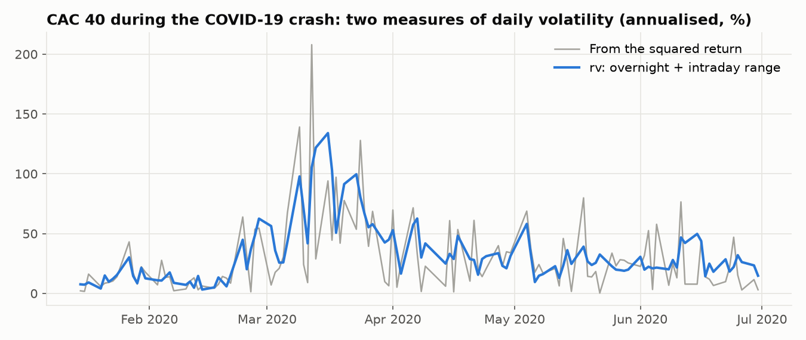

**Targets.** For each horizon of 1, 5 and 22 trading days: the logarithm of the average daily variance over the following *h* days.

**Features.** 18 variables, each motivated by a finding of the exploratory analysis:

| Group | Features | Motivation |
|---|---|---|
| Own volatility | Day, week, month, quarter, long-run level | Clustering and long memory (the first three form the HAR model) |
| Returns | Daily, weekly, monthly return; negative return; share of variance from down days | Leverage effect |
| Instability, activity | Volatility of volatility; volume relative to its monthly average | Unstable or unusually active markets |
| Market | Volatility of the median European stock (day, week, month) | Co-movement across markets |
| Implied volatility | VIX level and 5-day change, lagged one US session | Forward-looking expectations |
| Calendar | Day of the week | Seasonality |

The final dataset has **371,839 complete rows** (59 series, December 2000 to August 2026).

**No look-ahead.** A row dated *t* contains only what is known at the close of day *t*; targets use days *t+1* onwards. This is enforced by unit tests ([`tests/test_features.py`](tests/test_features.py)): the features are rebuilt on data truncated at a date *T* and must be identical to the full-sample features up to *T*, and changing today's prices must leave today's targets unchanged. The VIX is taken from the last US session strictly before *t*, because the US market closes after Europe.

## Evaluation framework and baselines

Every model of the project is evaluated by the same code, on the same dates and with the same loss functions. Details in [`notebooks/04_baselines.ipynb`](notebooks/04_baselines.ipynb); code in [`src/evaluation/`](src/evaluation/) and [`src/models/`](src/models/).

**Walk-forward backtest.** Each calendar year from 2006 is forecast by a model that has only seen earlier data (expanding window, 21 test years). The last *h* days before each test year are removed from training, because their targets overlap the test period (embargo).

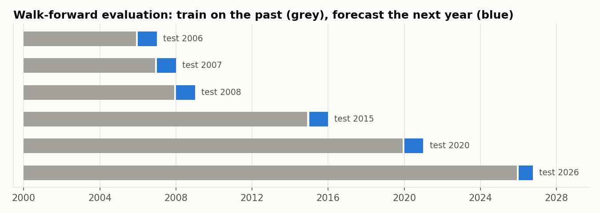

**Loss functions.**

| Loss | Role | Why |
|---|---|---|
| QLIKE | Primary | Standard in the volatility literature: robust to the noise in the variance measure, and under-predicting risk costs more than over-predicting it |
| MSE of log variance | Secondary | Symmetric; the quantity the machine-learning models are trained on |
| MAE in annualised volatility points | Interpretation | "The forecast is off by 7 volatility points on average" |

Models are compared on a **common sample** (dates on which every model has a forecast), and the scores are computed in SQL from the stored forecasts, so they can be reproduced without Python.

**Baselines.** Five rules with no estimated parameters: the last observed value (naive), the average of the last month, the historical mean, an EWMA of the range-based variance (λ = 0.94) and RiskMetrics (the same EWMA applied to squared returns).

Out-of-sample QLIKE, 2006 to 2026, about 307,000 forecasts per model and horizon (lower is better):

| Baseline | 1 day | 5 days | 22 days |
|---|---|---|---|
| **EWMA of range-based variance** | **0.440** | **0.273** | **0.250** |
| Monthly average | 0.468 | 0.302 | 0.281 |
| RiskMetrics (EWMA of squared returns) | 0.478 | 0.317 | 0.298 |
| Naive (last value) | 0.781 | 0.324 | 0.281 |
| Historical mean | 0.728 | 0.528 | 0.414 |

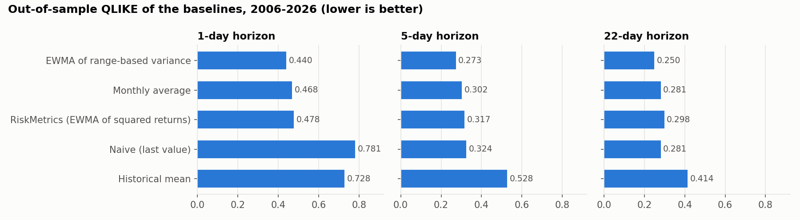

- **The bar to beat is the EWMA of the range-based variance**, with an average error of 7.1 volatility points at the 5-day horizon.
- **Measurement matters as much as the model.** EWMA and RiskMetrics are the same formula; feeding it the range-based variance of Step 4 instead of squared returns lowers QLIKE by 8% (1 day) to 16% (22 days).
- **Volatility is too persistent for its long-run average:** the historical mean is the worst baseline beyond one day, with errors almost twice as large as the others.
- **No baseline wins everywhere.** In crisis periods (19% of forecasts) the naive forecast, which reacts fastest, has the lowest 5-day QLIKE (0.271 against 0.297 for EWMA); in calm periods EWMA is clearly better (0.267 against 0.337).

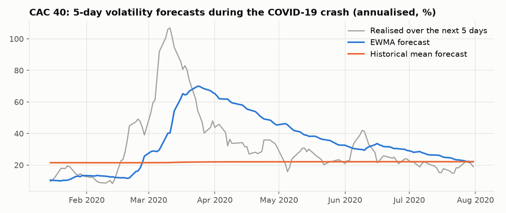

Simple averages only react **after** volatility has risen and stay too high once markets calm down. Reacting faster in both directions is what the models of the next steps must achieve.

## Econometric models

Four models with **estimated** parameters, re-estimated for every test year. Details in [`notebooks/05_econometric_models.ipynb`](notebooks/05_econometric_models.ipynb); code in [`src/models/garch.py`](src/models/garch.py) and [`src/models/har.py`](src/models/har.py).

| Model | Input | Estimation |
|---|---|---|
| GARCH(1,1) | Daily returns | Maximum likelihood, one model per series |
| GJR-GARCH | Daily returns | Same, with a stronger reaction to negative returns (leverage effect) |
| HAR | Range-based variance of the last day, week and month | Pooled linear regression (one for all series) |
| HAR-X | HAR + the 14 other features of Step 4 (leverage, market volatility, VIX…) | Pooled linear regression |

Out-of-sample QLIKE, 2006 to 2026, same sample as the baselines (lower is better):

| Model | 1 day | 5 days | 22 days |
|---|---|---|---|
| **HAR-X** | **0.378** | **0.220** | **0.199** |
| HAR | 0.400 | 0.242 | 0.212 |
| GJR-GARCH | 0.431 | 0.262 | 0.222 |
| GARCH(1,1) | 0.441 | 0.271 | 0.226 |
| *EWMA (best baseline)* | *0.440* | *0.273* | *0.250* |

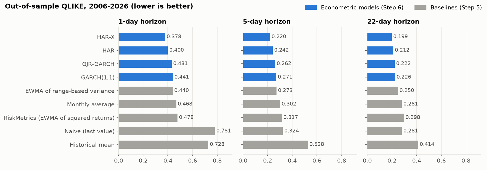

- **HAR-X is the model to beat:** it lowers QLIKE by 14% (1 day) to 20% (22 days) compared with the best baseline, with an average error of 6.4 volatility points at the 5-day horizon (7.1 for EWMA). It is the best model in calm and in crisis periods, for stocks and for indices.
- **Measurement is worth as much as modelling.** At the 5-day horizon, estimating the weights lowers QLIKE by 11 to 14%, and so does replacing squared returns by the range-based variance. As a result GARCH, an estimated model fed with squared returns, is only as accurate as EWMA, a fixed rule fed with the range-based variance (0.271 against 0.273).

  | QLIKE, 5 days | Fixed weights | Estimated weights |
  |---|---|---|
  | Squared returns | RiskMetrics 0.317 | GARCH 0.271 |
  | Range-based variance | EWMA 0.273 | HAR 0.242 |

- **The leverage effect is confirmed.** In GJR-GARCH, a fall moves the variance more than twice as much as a rise for 90% of the series; starting from a volatility of 20%, a 6% fall takes the next day's volatility to 36%, a 6% rise to 24%.

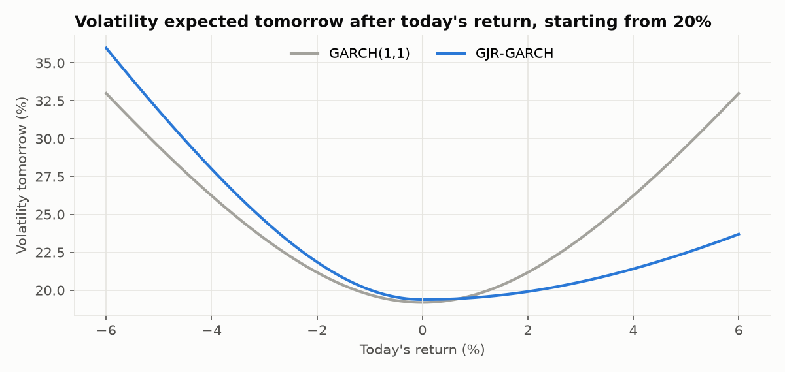

- **The further the horizon, the more the last month matters:** in HAR, its weight goes from 0.36 (1-day forecast) to 0.48 (22-day forecast), while the weight of the last day falls from 0.22 to 0.11.
- **A model of the log variance needs a correction to forecast the variance.** The exponential of a predicted logarithm is a forecast of the median, which under-predicts risk by about 20% on average. Multiplying by a correction factor estimated in training (Duan's smearing estimator) lowers the 5-day QLIKE of HAR from 0.267 to 0.242.

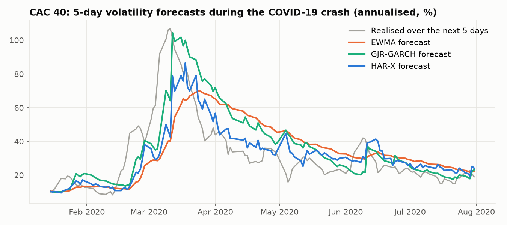

Implementation notes:

- GARCH is implemented from scratch (NumPy / SciPy) so that every step is visible, and tested on simulated data and against the `arch` package ([`tests/test_garch.py`](tests/test_garch.py)).
- Series with less than two years of returns borrow the typical dynamics of the other series and keep their own variance level.
- Known limitation: for **indices**, GARCH and HAR forecasts are 12 to 15% too high on average (GARCH because close-to-close returns are more volatile than the range-based target, HAR because one regression serves all series). HAR-X, which knows each series' long-run level, reduces this to 5%.

## Machine learning: LightGBM

Can a non-linear model extract more from the same features than the linear HAR-X? Details in [`notebooks/06_lightgbm.ipynb`](notebooks/06_lightgbm.ipynb); code in [`src/models/boosting.py`](src/models/boosting.py).

| Model | Design |
|---|---|
| LightGBM | Gradient-boosted trees forecasting the variance from the 17 features of HAR-X, the day of the week and a stock / index flag |
| HAR-X + LightGBM (hybrid) | HAR-X gives a first forecast; the trees learn a multiplicative correction to it |

- **Trained directly on QLIKE:** LightGBM's gamma objective has the same loss function, so the models forecast the mean of the variance without a correction factor.
- **Tuned without leakage:** hyperparameters are chosen by Optuna on the last two years of each training window, never on test data, and re-tuned for the test years 2006, 2013 and 2020. Optuna consistently selects small, regularised trees (5 to 30 leaves).

Out-of-sample QLIKE, 2006 to 2026 (lower is better):

| Model | 1 day | 5 days | 22 days |
|---|---|---|---|
| HAR-X + LightGBM | **0.371** | 0.220 | 0.214 |
| LightGBM | 0.372 | 0.221 | 0.216 |
| HAR-X | 0.378 | **0.220** | **0.199** |

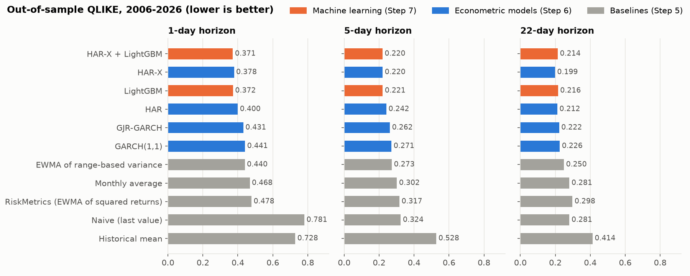

- **LightGBM matches HAR-X but does not beat it overall:** slightly better at 1 day (QLIKE 1.8% lower for the hybrid), equal at 5 days, 8% worse at 22 days, where overlapping targets leave few independent observations and a flexible model fits noise.
- **In logarithms, volatility is close to linear.** A regression with 18 coefficients captures almost everything that hundreds of trees can find; the more complex model is not the better one, and HAR-X remains the reference.
- **How a tree model is used matters.** The hybrid beats HAR-X in 14 test years out of 21, LightGBM alone in 7. In 2008, LightGBM alone is 5% worse than HAR-X, because a tree cannot forecast a volatility level it has never seen, while the hybrid is 2% better.
- **The bias on indices disappears:** HAR-X forecasts were 5% too high on average for indices; the tree models bring indices in line with stocks.

**What the trees add (SHAP values).** SHAP values split each forecast into the contribution of every feature. In the hybrid, the corrections are small (1 to 3% of the forecast for the most important features) and concern the state of the market rather than the series itself:

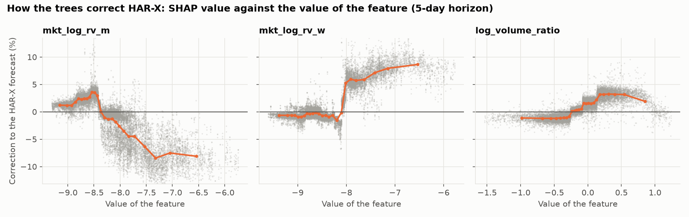

- when the market-wide volatility of the **last week** exceeds about 28%, the forecast is raised by 5 to 9%;
- when the market has been volatile for a **month**, it is lowered by up to 8%: fresh stress raises the forecast, lasting stress fades faster than a linear model assumes;
- unusually high **trading volume** adds about 3%.

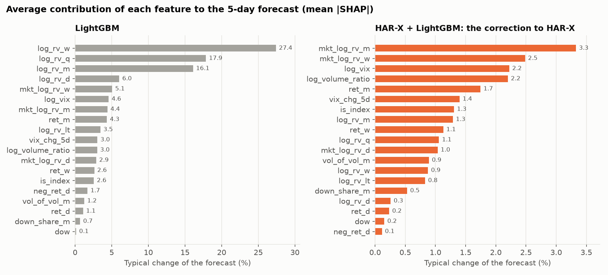

## Deep learning: LSTM and Transformer

Can a neural network that reads the raw daily history do better than models fed with hand-made summaries? Details in [`notebooks/07_deep_learning.ipynb`](notebooks/07_deep_learning.ipynb); code in [`src/models/deep.py`](src/models/deep.py) (PyTorch).

```
tabular features of day t ─────────────────────┬──> linear layer ─────────────┐
                                               │                             (+)──> log variance for 1, 5 and 22 days
last 22 days ──> LSTM or Transformer ──> [concatenate] ──> small network ──────┘
```

- **Two sequence encoders:** an LSTM, which reads the 22 days in order and keeps a memory, and a Transformer, in which every day can look at every other day (self-attention).
- **A linear path inside the network**, initialised with the least-squares solution: training starts from HAR-X, and the forecast can follow volatility beyond the levels seen in training.
- **Trained on QLIKE, one network for the three horizons**, re-trained for every test year. The number of epochs is chosen by early stopping on the last year of the training window, and features are standardised with training statistics only.

Out-of-sample QLIKE, 2006 to 2026 (lower is better):

| Model | 1 day | 5 days | 22 days |
|---|---|---|---|
| HAR-X + LightGBM | **0.371** | 0.220 | 0.214 |
| Transformer | 0.372 | 0.222 | 0.212 |
| LSTM | 0.373 | 0.221 | 0.206 |
| HAR-X | 0.378 | **0.220** | **0.199** |

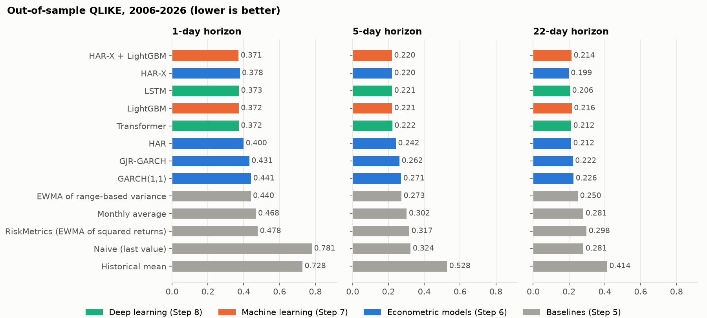

- **Deep learning does not beat HAR-X either:** slightly better at 1 day (QLIKE about 1.4% lower), level at 5 days, worse at 22 days (+3.6% for the LSTM, +6.8% for the Transformer). Across three families of models (econometric, tree-based, neural), accuracy converges to the same level: what remains is mostly unpredictable.
- **Complex models fail differently:** not by being slightly worse everywhere, but by rare, large errors in years unlike their training data. The LSTM beats HAR-X in 12 test years out of 21, but is 47% worse in 2009, after being trained on the 2008 crisis; the Transformer is 24% worse in 2020.

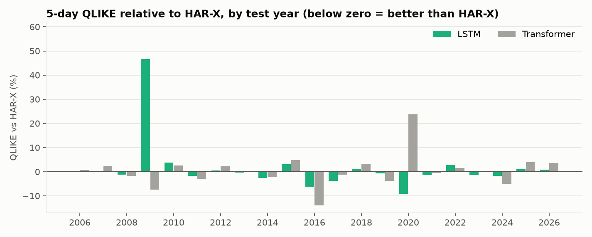

- **The LSTM is the better network here:** closer to HAR-X, more robust in crises, and twelve times faster to train (24 minutes against 4 hours 40 minutes on a laptop CPU, for 21 trainings each). A 22-day sequence is too short for the Transformer's strength to matter.
- **Early stopping often stops after one epoch** (8 of 21 trainings): starting from HAR-X, there is frequently little left to learn.

Limitations: the size of the networks (32 hidden units) and the length of the sequence (22 days) were chosen by judgement, not tuned, and each network was trained with a single random seed.

### The most accurate model on average is not the safest one

The Transformer is the best of the thirteen models by mean absolute error, and behind HAR-X by QLIKE. Both are true:

| | MAE, 5 days | MAE, 22 days | QLIKE, 5 days | QLIKE, 22 days | QLIKE, calm periods | QLIKE, stress periods |
|---|---|---|---|---|---|---|
| Transformer | **6.30** | **6.16** | 0.222 | 0.212 | **0.223** | 0.215 |
| HAR-X | 6.41 | 6.24 | **0.220** | **0.199** | 0.225 | **0.200** |

The two losses do not measure the same thing. A forecast of 40% followed by an outcome of 20%, and a forecast of 20% followed by an outcome of 40%, are both wrong by 20 volatility points: for MAE they are identical, while for QLIKE **under-estimating risk costs two and a half times more** (1.61 against 0.64). The Transformer is very close on the many ordinary days and too low on the few days when volatility jumps, which gives an excellent MAE and a poor QLIKE.

In practice a volatility forecast is used to size risk (a Value-at-Risk limit, a capital buffer, a position). A forecast that is too high leaves some capital idle; a forecast that is too low in a crisis means losses beyond what was provisioned, at the worst moment. The loss function has to reflect that asymmetry, and it has to be chosen **before** looking at the results: QLIKE was fixed as the primary loss in Step 5, otherwise almost any model could be declared the winner.

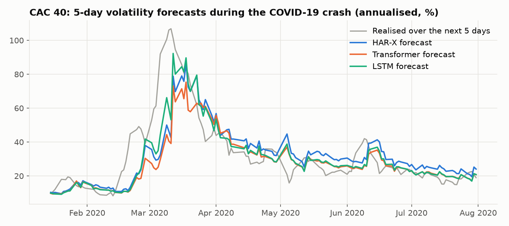

At the peak of the COVID-19 crash, the Transformer (orange) stays well below the other forecasts: accurate before and after, too low when it matters. Step 10 tests this directly by backtesting Value-at-Risk with each model.

## Model comparison: what is really different, and why

Fifteen models, often within one or two percent of each other. [`notebooks/08_model_comparison.ipynb`](notebooks/08_model_comparison.ipynb) tests whether the differences are real and where the accuracy comes from; code in [`src/evaluation/stats.py`](src/evaluation/stats.py) and [`src/evaluation/experiments.py`](src/evaluation/experiments.py).

**Final ranking** (out-of-sample QLIKE, 2006 to 2026, lower is better):

| Model | 1 day | 5 days | 22 days |
|---|---|---|---|
| **Ensemble: mean of HAR-X, both LightGBM models and both networks** | **0.369** | **0.216** | 0.202 |
| Ensemble: median of the same five | 0.370 | 0.217 | 0.201 |
| HAR-X + LightGBM | 0.371 | 0.220 | 0.214 |
| HAR-X | 0.378 | 0.220 | **0.199** |
| LSTM | 0.373 | 0.221 | 0.206 |
| LightGBM | 0.372 | 0.221 | 0.216 |
| Transformer | 0.372 | 0.222 | 0.212 |
| HAR | 0.400 | 0.242 | 0.212 |
| GJR-GARCH | 0.431 | 0.262 | 0.222 |
| EWMA (best baseline) | 0.440 | 0.273 | 0.250 |

**Are the differences real?** Diebold-Mariano tests on the daily average loss (one observation per date, Newey-West variance) and the Model Confidence Set (block bootstrap):

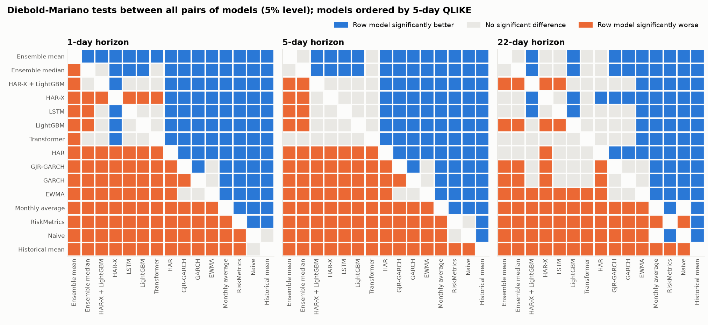

- **1 day: the gains of the complex models are real but small.** The five advanced models and the two combinations are all significantly better than HAR-X (p < 0.01), by 1.3 to 2.4%.
- **5 days: the algorithm does not matter.** A linear regression, gradient-boosted trees, an LSTM and a Transformer cannot be distinguished statistically (p-values of 0.56 to 0.91 against HAR-X). Only the combinations are significantly better.
- **22 days: HAR-X is the best**, and the LightGBM models are significantly worse (+8%, p < 0.001).
- **What is never in doubt:** HAR-X beats HAR, GARCH and every baseline significantly. Measuring volatility well and using the right information matter far more than the choice of the algorithm.

**Combining models is the one reliable improvement.** The average of the five models that use the full feature set (fixed in advance, equal weights) is significantly better than HAR-X at 1 and 5 days, and better in 19 test years out of 21. The single models fail in different years (the LSTM in 2009, the Transformer in 2020), and averaging dilutes each one's mistakes:

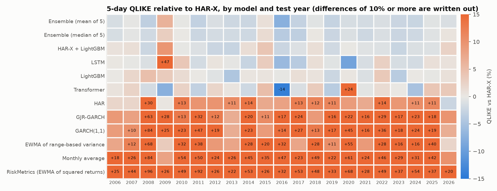

**Where does the accuracy come from?** HAR-X re-estimated with one group of features added or removed at a time:

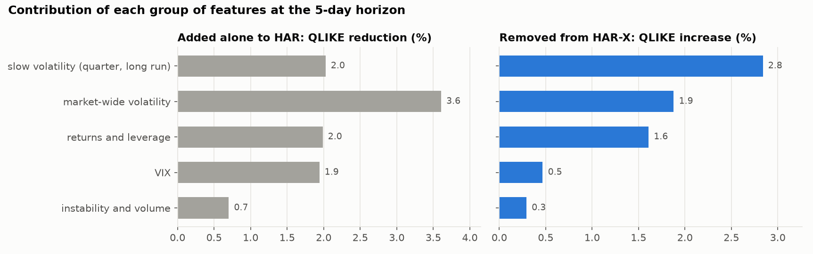

- No group is essential: removing any one costs at most 2.8%. The 9% gain of HAR-X over HAR is the sum of several modest contributions.
- The **slow components of volatility** (quarterly average, long-run level) are the least replaceable; the **VIX** looks useful alone (-1.9%) but is almost redundant once European market-wide volatility is in the model (+0.5%).
- **Equal information before comparing:** the tree and neural models removed the bias of HAR-X on indices, but they had a stock / index flag that HAR-X did not. Given the same flag, the linear model is fixed just as well (actual / forecast from 0.945 to 1.001): the improvement came from the information, not from non-linearity.

**Does the model work on markets it has never seen?** For each of seven regions, HAR-X is re-estimated without any stock or index of that region, then used to forecast them:

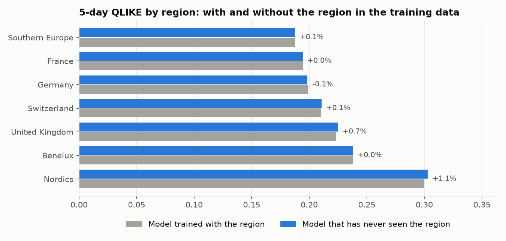

The loss is below 0.2% for five regions out of seven, and 1.1% at most (Nordics). The model has learned a general law of volatility, not the behaviour of 59 particular series.

**Recommendation.** For horizons of 1 to 5 days, the average of the five models; for a month, HAR-X alone. If only one model can be maintained, HAR-X: within 2.4% of the best at every horizon, estimated in seconds, 18 readable coefficients, and no bad year.

## Methodology (next steps)

| Level | Models | Status |
|---|---|---|
| Baselines | Naive, monthly average, historical mean, EWMA, RiskMetrics | ✅ |
| Econometrics | GARCH(1,1), GJR-GARCH, HAR, HAR-X | ✅ |
| Machine learning | LightGBM, HAR-X + LightGBM hybrid | ✅ |
| Deep learning | LSTM, Transformer (PyTorch) | ✅ |

**Next:** Value-at-Risk backtesting with the Kupiec test (Step 10), Power BI dashboard (Step 11).

## Tech stack

- **Language:** Python
- **Data:** pandas, NumPy, yfinance
- **Database:** PostgreSQL, SQLAlchemy, psycopg2
- **Econometrics:** GARCH maximum likelihood with SciPy (checked against `arch`), HAR regressions with NumPy
- **Machine learning:** LightGBM, Optuna, SHAP values (TreeSHAP)
- **Deep learning:** PyTorch (LSTM and Transformer written from scratch)
- **Results tracking and testing:** forecasts and scores stored in PostgreSQL, pytest
- **Visualisation and dashboard:** matplotlib, plotly, Power BI (connected to PostgreSQL)

## Repository structure

```
european-volatility-forecasting/
├── data/
│   └── universe.csv    # list of tickers with country, sector, currency
├── sql/
│   ├── schema.sql      # PostgreSQL tables, keys, constraints and views
│   └── score_models.sql  # loss functions computed in SQL from the stored forecasts
├── notebooks/          # 01_data_quality, 02_eda, 03_features, 04_baselines, 05_econometric_models, 06_lightgbm, 07_deep_learning, 08_model_comparison, ...
├── src/
│   ├── db.py           # database connection (reads .env)
│   ├── viz.py          # shared chart style
│   ├── data/           # database setup, download and cleaning
│   ├── features/       # volatility estimators, targets, features
│   ├── models/         # common model interface, baselines, GARCH, HAR, LightGBM, neural networks
│   └── evaluation/     # walk-forward splits, backtest, loss functions, statistical tests, experiments
├── tests/              # unit tests (incl. data-leakage checks)
├── reports/figures/    # charts used in this README
├── powerbi/            # Power BI dashboard (.pbix)
├── .env.example        # template for database credentials
├── requirements.txt
└── requirements-dl.txt # deep learning dependencies
```

## Getting started

**Prerequisites:** Python 3.10+ and [PostgreSQL](https://www.postgresql.org/download/) running locally.

```bash
git clone https://github.com/vinhdang111/european-volatility-forecasting.git
cd european-volatility-forecasting

python -m venv .venv
source .venv/bin/activate        # Windows: .venv\Scripts\activate

pip install -r requirements.txt
pip install -e .                 # makes `src` importable from notebooks
```

Copy `.env.example` to `.env` and enter your PostgreSQL password, then:

```bash
python -m src.data.setup_db      # create database, tables and load the universe
python -m src.data.fetch_prices  # download all price data into PostgreSQL (~2-3 minutes)
python -m src.data.clean_prices  # clean the prices (prices_clean + cleaning_log)
python -m src.features.build_features  # daily variance, features and targets
python -m src.models.run_baselines     # walk-forward backtest of the baselines (forecasts + scores)
python -m src.models.run_econometric   # GARCH, GJR-GARCH, HAR, HAR-X (a few minutes)
python -m src.models.run_lightgbm      # LightGBM and hybrid, with Optuna tuning (20 to 40 minutes)
python -m src.models.run_deep          # LSTM and Transformer (needs PyTorch, see below)
python -m src.evaluation.run_comparison  # forecast combinations, statistical tests, ablation (a few minutes)
python -m pytest                 # run the unit tests
```

The deep learning models need PyTorch: `pip install -r requirements-dl.txt`. They train on a GPU if PyTorch finds one, otherwise on the CPU (about 25 minutes for the LSTM and several hours for the Transformer on a laptop; `--refit-every 3` trains one network every three years instead of every year).

## Project status

| Step | Description | Status |
|---|---|---|
| 0 | Project setup | ✅ Done |
| 1 | Data collection | ✅ Done |
| 2 | Data cleaning and quality checks | ✅ Done |
| 3 | Exploratory analysis: stylised facts of volatility | ✅ Done |
| 4 | Volatility targets and feature engineering | ✅ Done |
| 5 | Evaluation framework and baselines | ✅ Done |
| 6 | Econometric models (GARCH, GJR-GARCH, HAR) | ✅ Done |
| 7 | Machine learning (LightGBM, SHAP) | ✅ Done |
| 8 | Deep learning (LSTM, transformer) | ✅ Done |
| 9 | Model comparison and statistical analysis | ✅ Done |
| 10 | Application: Value-at-Risk backtesting | ⏳ Next |
| 11 | Interactive dashboard (Power BI) | ⬜ |
| 12 | Final report and documentation | ⬜ |

## Author

**Thanh Vinh Dang**

[LinkedIn](https://www.linkedin.com/in/thanhvinhdang2001) · thanhvinhdang.work@gmail.com
